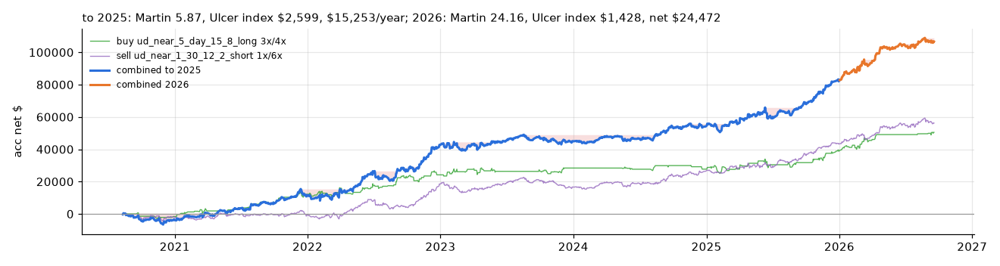
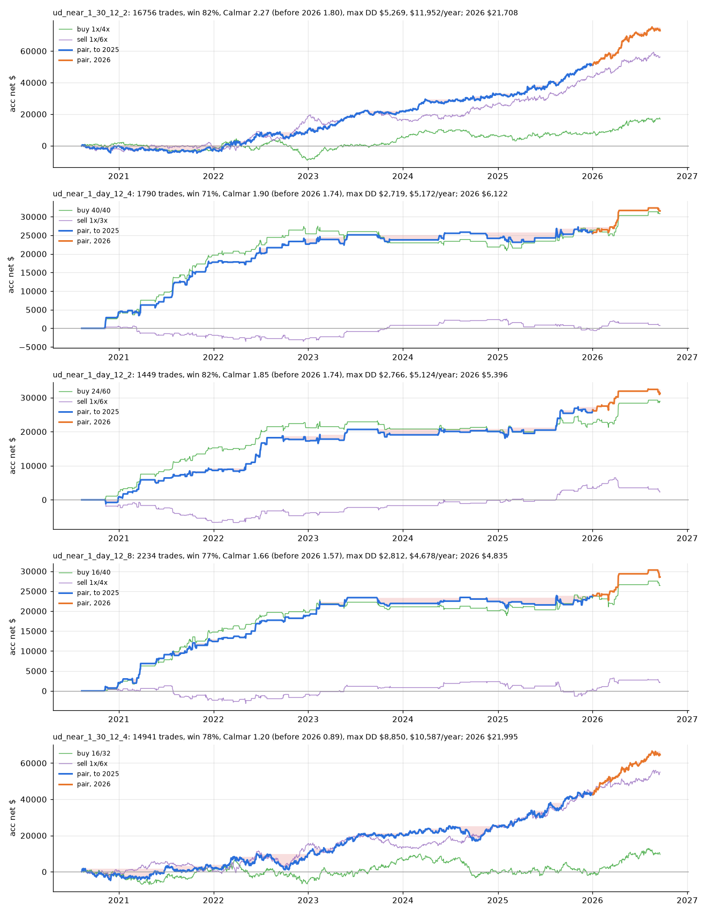
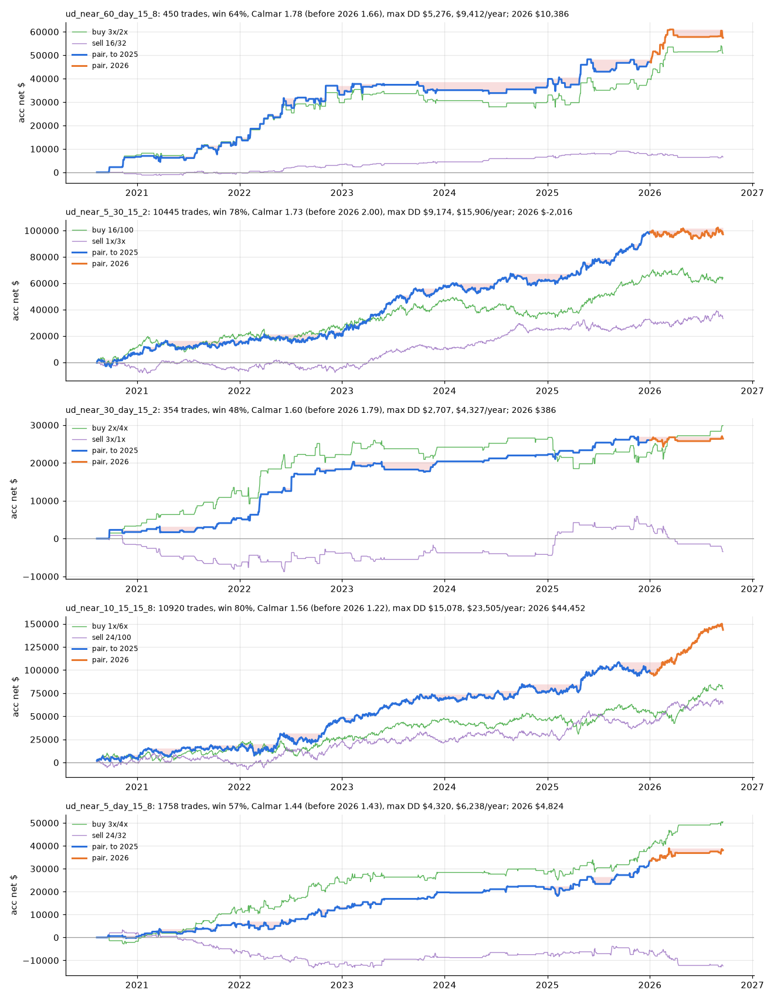
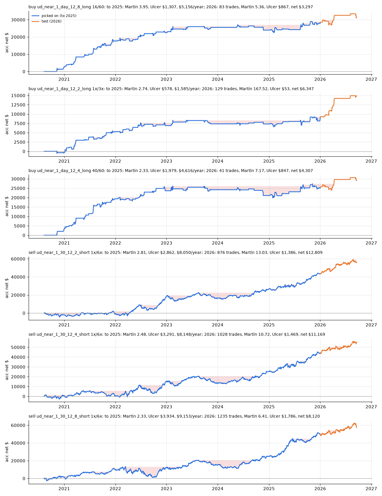
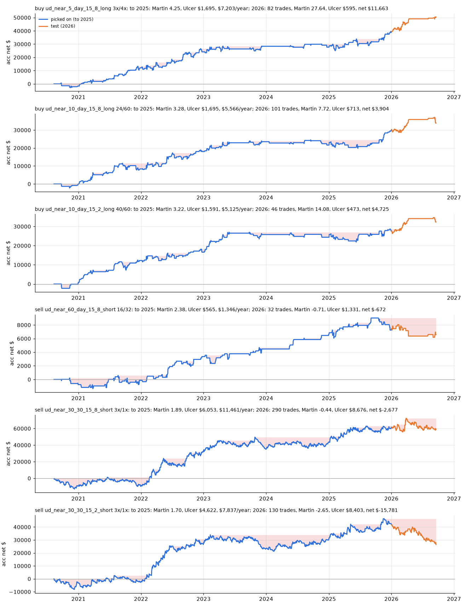

# UD pivot strategies with limit entries

Research summary, 2026-09-28. ES futures, 2020-05 to 2026-09-18 (6.1 years), 1 contract per strategy, limit orders
throughout with no slippage, $1.90 commission per side, volatility band (0.2, 0.8), no entries on news. Units and
costs as in [rsi.md](rsi.md). The U/D pivots are feature engineering's `20_UD_last1..5_{timeframe}`, newest first.

**Result in one line:** trading a timeframe's pivots both ways as a long + short pair gives Calmar 1.4-2.3 in sample.
The **daily range with 1-min execution** is the lead: Calmar 1.66-1.90 at all three distances and positive in 2026.
Picked on 2020-2025 only by the Martin ratio (smooth curves), the best long (version 2, near daily pivots) with the
best short (version 1, near the 30-min range) scores Martin 5.87 and made +$24,472 in 2026, which it had not seen.

Two versions were tried; **version 1 is the setup to keep**.

## What to trade: one contract per side

One buy run and one sell run, 1 contract each, both picked on 2020-2025 only by the Martin ratio (see
[below](#the-best-long-and-the-best-short-together)):

- **Buy:** version 2, 5-min bars, within 2 points of any of the last 5 daily pivots, stops 3x / 4x volatility
  (`ud_near_5_day_15_8_long 3x/4x`).
- **Sell:** version 1, 1-min execution, within 0.5 point of the 30-min range, stops 1x / 6x volatility
  (`ud_near_1_30_12_2_short 1x/6x`).



| | Martin to 2025 | Ulcer to 2025 | Max drawdown (whole period) | 2026 net | 2026 max drawdown |
|---|---|---|---|---|---|
| **Buy + sell** | **5.87** | $2,599 | $7,207 (2021-12 to 2022-02) | **+$24,472** | **$4,128** (Mar 10 to Mar 20) |
| Buy alone | 4.25 | $1,695 | $5,354 | +$11,663 | $2,523 |
| Sell alone | 2.81 | $2,862 | $7,349 | +$12,809 | $3,715 |

- **Why the sell from version 1:** picked once on all history up to 2025, all 16 rankings tried (mixes of Sharpe,
  win rate and Martin, and Calmar) choose exactly this sell. Version 2's sells lose out of sample.
- **Why the buy from version 2:** it is the best buy by Martin in either version (4.25, against 3.95 for version 1's
  best, its buy within 2 points of the daily range, 16/60). Both buy near the daily pivots; version 1's own buy with
  the same sell made +$16.1k in 2026.
- **Where the drawdowns come from:** the stops are wide volatility multiples (the sell wins about $75 and loses about
  $366); the buy re-buys a daily level after it breaks (2022-02-04: five buys near 4,520, four stopped, -$3,098); both
  legs lose together in volatile stretches.
- **News:** no trade starts within 5 minutes of an FOMC / NFP / CPI / PPI / GDP release. Also closing open trades when
  a news window starts barely changes the pair (Martin 5.77, 2026 +$25.1k), so the trades are left open.
- **Before live money:** the sell leg earns about $7 a trade, within the fill model's error (98% modelled against
  about 89% strict limit fills); a strict fill check, a drift check on the buy leg and a few months of paper trading
  come first.

## Version 1: UD range, 1-min execution (the one to keep)

- Execution always on **1-min bars**: the signal is checked at each minute's close, the trade enters the next minute.
- The range is the **last two pivots** (`last1`, `last2`) of **one timeframe per run**: 5, 10, 15, 30, 60-min or day.
- Long and short, as separate strategies, while the 1-min close is within 0.5, 1 or 2 points of either end of the
  range; each side over the fixed TP / SL grid (16..100 units) and the volatility grid (1..6 x `20_std_1`).
- Each trade keeps `near`: every timeframe whose range end was that close at its signal minute (e.g. `30,60`).
- 6 timeframes x 3 distances = 18 conditions; per condition the best long + short pair by Calmar, where a pair is one
  condition's long run and short run, differing only in side and stops. Mirror pairs (the short's stops the long's
  swapped: the same trade both ways) are left out.



| # | Range, within | Buy | Sell | Trades | Win | Calmar | Before 2026 | Max DD | Net per year | 2026 |
|---|---|---|---|---|---|---|---|---|---|---|
| 1 | 30-min, 0.5 pt | 1x/4x | 1x/6x | 16,756 | 82% | 2.27 | 1.80 | $5,269 | $11,952 | +$21,708 |
| 2 | **day, 1 pt** | 40/40 | 1x/3x | 1,790 | 71% | **1.90** | 1.74 | $2,719 | $5,172 | +$6,122 |
| 3 | **day, 0.5 pt** | 24/60 | 1x/6x | 1,449 | 82% | 1.85 | 1.74 | $2,766 | $5,124 | +$5,396 |
| 4 | **day, 2 pts** | 16/40 | 1x/4x | 2,234 | 77% | 1.66 | 1.57 | $2,812 | $4,678 | +$4,835 |
| 5 | 30-min, 1 pt | 16/32 | 1x/6x | 14,941 | 78% | 1.20 | 0.89 | $8,850 | $10,587 | +$21,995 |

- **The daily range holds at every distance.** The buy leg carries it (about +$80 a trade, profit factor 1.3-1.5);
  the sell leg breaks even but roughly halves the drawdown. Asia and US sessions earn, Europe is flat or losing;
  regular hours earn about twice as much per trade as outside them.
- **The 30-min range pairs (#1, #5) are thin:** $1-7 a trade over about 16,000 trades with 1x-volatility take-profits
  and 4-6x stop-losses, 80%+ wins. That is where the optimistic limit fills matter most.
- Two or more ranges near at once (`near`) does not consistently help.

## Version 2: UD near-pivot, 5-60-min bars (earlier; not the setup to keep)

- Trades 5, 10, 15, 30 or 60-min bars; the levels are the **last five pivots** of one timeframe, from the bar size up
  to day; long and short while the bar's close is within 0.5, 1 or 2 points of any of the five.
- 20 bar / timeframe combinations x 3 distances = 60 conditions, the same stop grids, pairs and mirror rule.



| # | Bars / pivots / within | Buy | Sell | Trades | Win | Calmar | Before 2026 | Max DD | Net per year | 2026 |
|---|---|---|---|---|---|---|---|---|---|---|
| 1 | 60-min / day / 2 pts | 3x/2x | 16/32 | 450 | 64% | 1.78 | 1.66 | $5,276 | $9,412 | +$10,386 |
| 2 | 5-min / 30-min / 0.5 pt | 16/100 | 1x/3x | 10,445 | 78% | 1.73 | 2.00 | $9,174 | $15,906 | -$2,016 |
| 3 | 30-min / day / 0.5 pt | 2x/4x | 3x/1x | 354 | 48% | 1.60 | 1.79 | $2,707 | $4,327 | +$386 |
| 4 | 10-min / 15-min / 2 pts | 1x/6x | 24/100 | 10,920 | 80% | 1.56 | 1.22 | $15,078 | $23,505 | +$44,452 |
| 5 | 5-min / day / 2 pts | 3x/4x | 24/32 | 1,758 | 57% | 1.44 | 1.43 | $4,320 | $6,238 | +$4,824 |

## Picked without seeing 2026, by the Martin ratio

The tables above pick on the whole period, 2026 included. Here every pick is made on **2020-05 to 2025-12 only** and
then tested on 2026 (to 09-18), and ranked by the **Martin ratio** for smooth curves instead of saw-like ones:

- **Martin** = net per year / **Ulcer index**. The Ulcer index is the root mean square of the drawdown (in $, from
  the running peak) over every session: how far below its peak the curve sits on a typical day. Every dip counts,
  the deep and long ones most. Calmar looks only at the single worst drawdown, so a saw-like curve can still score
  well by it.
- R² of the curve against a straight line was tried too. It rewards a straight long-run trend but ignores how deep
  the dips are: its version 1 longs had $17-25k drawdowns. So the ranking is by Martin.
- **No pairs:** per condition and side, the run (signal x stops, at least 100 trades) with the best Martin before
  2026; the top 3 longs and top 3 shorts.
- The 2026 Martin covers only 9 months, so it runs much higher than a 5-year one; compare the Ulcer index in $.

### Version 1: UD range, 1-min



| Side | Range, within, stops | Martin to 2025 | Ulcer to 2025 | $/year to 2025 | 2026 trades | 2026 win | 2026 Martin | 2026 Ulcer | 2026 net |
|---|---|---|---|---|---|---|---|---|---|
| buy | day, 2 pts, 16/60 | 3.95 | $1,307 | $5,156 | 83 | 82% | 5.36 | $867 | +$3,297 |
| buy | day, 0.5 pt, 1x/3x | 2.74 | $578 | $1,585 | 129 | 84% | 167.5 | $53 | +$6,347 |
| buy | day, 1 pt, 40/60 | 2.33 | $1,979 | $4,616 | 41 | 68% | 7.17 | $847 | +$4,307 |
| sell | 30-min, 0.5 pt, 1x/6x | 2.81 | $2,862 | $8,050 | 876 | 87% | 13.03 | $1,386 | +$12,809 |
| sell | 30-min, 1 pt, 1x/6x | 2.48 | $3,291 | $8,148 | 1,028 | 86% | 10.72 | $1,469 | +$11,169 |
| sell | 30-min, 2 pts, 1x/6x | 2.33 | $3,934 | $9,153 | 1,235 | 85% | 6.41 | $1,786 | +$8,120 |

All 6 made money in 2026, each with a typical dip below $1,800.

### Version 2: UD near-pivot, 5-60-min bars



| Side | Bars / pivots / within, stops | Martin to 2025 | Ulcer to 2025 | $/year to 2025 | 2026 trades | 2026 win | 2026 Martin | 2026 Ulcer | 2026 net |
|---|---|---|---|---|---|---|---|---|---|
| buy | 5-min / day / 2 pts, 3x/4x | 4.25 | $1,695 | $7,203 | 82 | 63% | 27.64 | $595 | +$11,663 |
| buy | 10-min / day / 2 pts, 24/60 | 3.28 | $1,695 | $5,566 | 101 | 74% | 7.72 | $713 | +$3,904 |
| buy | 10-min / day / 0.5 pt, 40/60 | 3.22 | $1,591 | $5,125 | 46 | 67% | 14.08 | $473 | +$4,725 |
| sell | 60-min / day / 2 pts, 16/32 | 2.38 | $565 | $1,346 | 32 | 62% | -0.71 | $1,331 | -$672 |
| sell | 30-min / 30-min / 2 pts, 3x/1x | 1.89 | $6,053 | $11,461 | 290 | 28% | -0.44 | $8,676 | -$2,677 |
| sell | 30-min / 30-min / 0.5 pt, 3x/1x | 1.70 | $4,622 | $7,837 | 130 | 24% | -2.65 | $8,403 | -$15,781 |

The longs held up in 2026; every short lost.

- **Both versions agree on the longs: buy near the daily pivots.** They earn $40-140 a trade in 2026.
- **Version 1's shorts near the 30-min range hold up;** version 2 has no short that works.
- Version 1's shorts win 85-87% with a 1x volatility take-profit against a 6x stop, about $15 a trade: smooth until a
  loss, and the most exposed to the optimistic limit fills.

### The best long and the best short together

The best long by Martin across both versions is version 2's (4.25 against version 1's 3.95), and the best short is
version 1's (2.81 against version 2's 2.38), both picked before 2026. Together, 1 contract each:


| | Martin to 2025 | Ulcer to 2025 | $/year to 2025 | 2026 Martin | 2026 Ulcer | 2026 net |
|---|---|---|---|---|---|---|
| **Buy + sell** | **5.87** | $2,599 | $15,253 | 24.16 | $1,428 | **+$24,472** |
| Buy: version 2, 5-min / day / 2 pts, 3x/4x | 4.25 | $1,695 | $7,203 | 27.64 | $595 | +$11,663 |
| Sell: version 1, 30-min range, 0.5 pt, 1x/6x | 2.81 | $2,862 | $8,050 | 13.03 | $1,386 | +$12,809 |

- **Together they beat either leg alone:** about both legs' profit with a typical dip smaller than the sell leg's
  alone. 8,765 trades, 84% wins; the worst drawdown over the whole period is $7,207 (2021-12-13 to 2022-02-04).
- **Where the dips come from:**
  - The stops are wide volatility multiples. The sell leg's average win is $75 against a median loss of $366.
  - The buy leg re-buys a daily level after it breaks. On 2022-02-04 it bought near 4,520 five times, was stopped
    out four times, and lost $3,098.
  - Both legs lose together: they did in 4 of the 5 worst drawdowns (late 2020, early 2022, June 2025, late 2023).
  - The curve was flat from mid-2023 to late 2024.
- The buy leg comes from version 2, which the in-sample study above left aside; this pair mixes the two sweeps.

```bash
python -m backtesting.pairs ud_range --holdout --singles --metric martin --top 3 --tag martin_top3
python -m backtesting.pairs ud_near --holdout --singles --metric martin --top 3 --tag martin_top3
python -m backtesting.pairs ud_range ud_near --metric martin --tag v2_long_v1_short \
    --combo ud_near_5_day_15_8_long:3x/4x ud_near_1_30_12_2_short:1x/6x
```

These write `acc_pnl_singles_holdout_martin_top3.png` and `singles_holdout_martin_top3.parquet` to each sweep folder,
and `acc_pnl_combo_v2_long_v1_short.png` to `results/sweep/ud_range/`. Several sweep folders passed to `pairs` are read
together. Copies are in `summary/ud/`.

## How to reproduce them

Needs step 2's `tick.dat` and `1_ohlcv.parquet` with the limit-entry columns, and step 3's training data. Costs and
filters come from `backtesting/config.py` as they are now.

```bash
python -m backtesting.sweep ud_range                     # version 1 (~16 min) -> results/sweep/ud_range/
python -m backtesting.pairs ud_range --look ud           # its top 5 plot and statistics (--breakdown: session, RTH, near)

python -m backtesting.sweep ud_near                      # version 2 (~20 min) -> results/sweep/ud_near/
python -m backtesting.pairs ud_near --look ud
```

Each `pairs` run writes `acc_pnl_pairs.png` and `pairs.parquet` to its sweep folder. Verified on 2026-09-28: the sweep
script gives identical trades to the original runs (15,235,976 for version 1), and the two commands give plots
pixel-identical to the kept ones above (`summary/ud/range_1min_top5_pairs.png`, `summary/ud/near_pivot_top5_pairs.png`).

## Caveats

- **In sample:** each pair is the best of about 3,700 stop combinations for its condition; 2026 was seen. The Martin
  section's picks did not see 2026, but 2026 is only 9 months.
- **Fills are optimistic** (see [rsi.md](rsi.md#caveats)): a buy and a sell limit at the same open both counted as
  filled; small take-profits are the most exposed.
- **Drift:** the daily range earns mostly on its buy leg while ES rose; a check against random 1-min buys in the same
  months and hours is still to do. So is a walk-forward on this sweep
  (`python -m backtesting.walk_forward --trades 'results/sweep/ud_range/trades_*.parquet' ...`).
